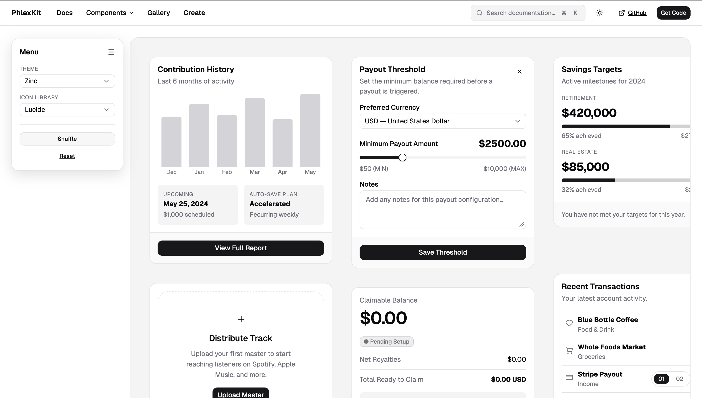

# PhlexKit

[](https://rubygems.org/gems/phlex_kit)
[](https://github.com/MatthewKennedy/phlex_kit/actions/workflows/ci.yml)

A [shadcn/ui](https://ui.shadcn.com)-grade component kit for
[Phlex](https://phlex.fun) + Rails, styled with **vanilla CSS + design tokens
instead of Tailwind**. The full [ruby_ui](https://ruby-ui.com) catalog plus
shadcn's own additions — 70 component families, 38 Stimulus controllers —
with the default theme lifted verbatim from shadcn/ui's current token system.

<picture>
  <source media="(prefers-color-scheme: dark)" srcset="docs/images/create-page-dark.png">
  <source media="(prefers-color-scheme: light)" srcset="docs/images/create-page-light.png">
  
</picture>

*Every pixel above is PhlexKit: [shadcn's /create demo](https://ui.shadcn.com/create)
rebuilt in the dummy app from kit components — cards, charts, sliders,
switches, nav menu, command palette — at `/create` in [the docs site](#the-docs-site).*

- **No build step.** Components are plain Ruby classes with co-located vanilla
  CSS, served precompiled-static through Propshaft. No Tailwind, no Node, no
  PostCSS.
- **The shadcn look, themeable.** Every component reads `--pk-*` custom
  properties. The default palette, radii, and control geometry match
  ui.shadcn.com; redefine `:root` and the whole kit re-themes live — dark,
  light, and system included.
- **`@hotwired/stimulus` only.** Every interactive component works with one
  registration call. The JS dependencies the upstream kits lean on
  (floating-ui, embla, fuse.js, vaul, Radix, chart.js, …) are all replaced
  with small vanilla equivalents — or, for charts, left to the host.
- **Reactive when you want it.** Components pass `**attrs` straight through
  Phlex's `mix`, so a [phlex-reactive](https://github.com/mhenrixon/phlex-reactive)
  `**on(:event)` bundle composes onto the root element with zero coupling.

## Install

```ruby
# Gemfile
gem "phlex_kit"
```

```bash
bundle install
bin/rails g phlex_kit:install
```

The installer adds `@import url("phlex_kit/phlex_kit.css");` to your
`application.css`, drops `config/initializers/phlex_kit.rb`, and prints the
Stimulus wiring. Then register the controllers once in your Stimulus
entrypoint:

```js
// app/javascript/application.js
import { Application } from "@hotwired/stimulus"
import { registerPhlexKitControllers } from "phlex_kit/controllers"

const application = Application.start()
registerPhlexKitControllers(application)
```

That's it — no Tailwind config, no content globs, no bundler.

For a full step-by-step walkthrough on the default Propshaft + importmap stack —
including how the `@import` chain and the Stimulus registration wire up, and how
to verify the install — see
[docs/05-PROPSHAFT-INSTALL.md](docs/05-PROPSHAFT-INSTALL.md).

## Usage

```ruby
render PhlexKit::Button.new(variant: :primary, size: :lg) { "Save changes" }

render PhlexKit::Card.new do
  render PhlexKit::CardHeader.new do
    render PhlexKit::CardTitle.new { "Team" }
    render PhlexKit::CardDescription.new { "Invite and manage members." }
  end
  render PhlexKit::CardContent.new { "…" }
end

render PhlexKit::Badge.new(variant: :secondary) { "Live" }
```

A form field with client-side live validation (fills the error once the
browser flags the control invalid, clears it as the user types):

```ruby
render PhlexKit::Form.new(action: "/users", method: "post") do
  render PhlexKit::FormField.new do
    render PhlexKit::FormFieldLabel.new(for: "email") { "Email" }
    render PhlexKit::Input.new(
      type: :email, id: "email", name: "email", required: true,
      data: { value_missing: "Email is required." }
    )
    render PhlexKit::FormFieldError.new
  end
  div(class: "pk-form-actions") do
    render PhlexKit::Button.new(type: :submit) { "Create account" }
  end
end
```

A toast, spawned from anywhere (mount `PhlexKit::ToastRegion.new(flash: flash)`
once at the end of `<body>` — server flash messages render as toasts too):

```js
PhlexKit.toast.success("Saved", { description: "Your changes are live." })
```

Prefer `UI::Button`? Turn on the alias in the initializer:

```ruby
PhlexKit.configure { |c| c.define_ui_alias = true }   # UI == PhlexKit
```

## Theming

The gem ships shadcn/ui's default (neutral) token set — dark by default, light
via `<html data-theme="light">`, OS-following via `data-theme="system"`.
Override any token in your own stylesheet; your app's CSS sorts ahead of the
gem's, so you win:

```css
@import url("phlex_kit/phlex_kit.css");

:root {
  --pk-brand: #3b5bdb;      /* primary buttons, selected states, slider fill */
  --pk-radius: 0.375rem;    /* every component radius derives from this */
}
```

The full token surface: `--pk-bg`, `--pk-surface`, `--pk-surface-2`,
`--pk-accent` (hover fills), `--pk-border`, `--pk-input` (control borders),
`--pk-ring` (focus rings), `--pk-text`, `--pk-text-2`, `--pk-muted`,
`--pk-brand`, `--pk-brand-ink`, `--pk-green`, `--pk-amber`, `--pk-red`,
`--pk-chart-1..5`, `--pk-radius`, plus `--pk-font-sans` / `--pk-font-mono`
(system stacks by default — override them after an @font-face to adopt Geist
like shadcn, as the docs site does). Want a fully custom palette? Drop the
`_tokens.css` import and define them all yourself.

Prefer a ready-made palette? The gem ships theme files under
`app/assets/stylesheets/phlex_kit/themes/` (`neutral`, `zinc`, `claude`) —
link one after the manifest and the cascade re-themes everything:

```ruby
stylesheet_link_tag "phlex_kit/phlex_kit"
stylesheet_link_tag "phlex_kit/themes/neutral"
```

The three knobs from ui.shadcn.com/create map directly: **Radius** →
`--pk-radius`; **Icon Library** → `PhlexKit.config.icon_library` (see Icons
below); **Menu** → `PhlexKit::Sidebar.new(menu: :default | :solid)`.

## Icons

Every built-in glyph renders through `PhlexKit::Icon`, which draws from a
vendored icon library — pick one kit-wide in an initializer:

```ruby
PhlexKit.configure do |c|
  c.icon_library = :tabler   # :lucide (default), :tabler, :phosphor, :remix
end
```

Use it directly with canonical semantic names (the per-library vocabulary is
pre-resolved — `:chevron_down` is Phosphor's `caret-down`, Remix's
`arrow-down-s-line`, and so on):

```ruby
render PhlexKit::Icon.new(:calendar)                     # 16px, configured library
render PhlexKit::Icon.new(:search, size: 24)
render PhlexKit::Icon.new(:check, library: :phosphor)    # per-instance override
```

`PhlexKit::Icons.names` lists the full catalog (~70 glyphs, all guaranteed to
resolve in all four libraries); unknown names fail loud. HugeIcons is not
included — its free set forbids redistributing the artwork inside a gem. Icon
path data licenses ship in `THIRD_PARTY_LICENSES` (Lucide ISC, Tabler MIT,
Phosphor MIT, Remix Apache-2.0).

## Charts

`PhlexKit::Chart` is deliberately a thin wrapper — **no charting library is
bundled**. Expose [Chart.js](https://www.chartjs.org) as `window.Chart` (a
vendored UMD file and one `javascript_include_tag` is enough) and the kit
builds the chart with shadcn-style theming: series colored from
`--pk-chart-1..5`, translucent area fills, hairline grids, re-rendering on
theme change.

```ruby
render PhlexKit::Chart.new(options: {
  type: "line",
  data: { labels: %w[Jan Feb Mar], datasets: [ { label: "Orders", data: [3, 7, 4], fill: true } ] }
})
```

No `window.Chart`? The controller dispatches `phlex-kit--chart:connect` with
`{ canvas, options }` so you can drive any other library.

For the full walkthrough — pinning Chart.js through **importmap** (and the
gotcha that makes the obvious `bin/importmap pin chart.js` fail), the UMD
alternative, and end-to-end verification — see
[docs/06-CHARTS.md](docs/06-CHARTS.md).

## phlex-reactive (optional)

For components that own server-state behavior, add phlex-reactive and include
its mixin — PhlexKit does **not** depend on it:

```ruby
class MyCounter < PhlexKit::BaseComponent
  include Phlex::Reactive::Component
  action(:increment) { @count += 1 }
  # view_template uses **on(:increment) on a button — it just flows through mix
end
```

`PhlexKit.reactive?` auto-detects the gem; set `config.reactive` to force it.

## Ejecting components (shadcn-style)

Want to own and edit a component's source? Eject it into your app:

```bash
bin/rails g phlex_kit:component button
```

This copies the whole component folder — `button.rb` (+ any parts), `button.css`,
and, for interactive components, `button_controller.js` — into
`app/components/phlex_kit/button/`, prepends its `@import`, and wires
`config/application.rb` once so your copy fully shadows the gem's — **Ruby, CSS,
and JS**. (It Zeitwerk-collapses the folder so `button/button.rb` autoloads as
`PhlexKit::Button`, and puts `app/components` ahead of the gem on Propshaft's
asset path so the ejected CSS/JS resolve to your copy, not the gem's.) Re-running
for another component reuses the same wiring — it's injected only once.

## The docs site

The dummy Rails app is a full shadcn-style docs site: a sidebar menu with one
page per component, every use case demoed with a Preview/Code toggle (the code
shown is extracted from the running example source, so it can never drift).
A one-page kitchen-sink gallery lives at /gallery:

```bash
git clone https://github.com/MatthewKennedy/phlex_kit && cd phlex_kit
bundle install
bundle exec puma -p 3999 test/dummy/config.ru
# open http://127.0.0.1:3999
```

By default the docs site renders the shadcn-parity baseline (default tokens,
lucide icons). Two env vars re-skin the whole site, handy for eyeballing a
theme or icon set across every component:

```bash
# Boot with a bundled theme (neutral, zinc, or claude)
PK_THEME=claude bundle exec puma -p 3999 test/dummy/config.ru

# Boot with a different icon library (lucide is the default; tabler, phosphor, remix)
PK_ICONS=tabler bundle exec puma -p 3999 test/dummy/config.ru

# Or both
PK_THEME=zinc PK_ICONS=phosphor bundle exec puma -p 3999 test/dummy/config.ru
```

`PK_THEME` links the matching file from
`app/assets/stylesheets/phlex_kit/themes/` after the manifest — the same
mechanism a host app uses. Light/dark/system switching is in the site's
header regardless of theme.

## Components

Everything in ruby_ui (53/53) plus shadcn/ui's own catalog: accordion, alert,
alert dialog, aspect ratio, attachment, avatar (+ group), badge, breadcrumb,
bubble, button, button group, calendar, card, carousel, chart, checkbox,
clipboard, codeblock, collapsible, combobox (button/input/badge-chip
triggers), command palette, context menu, data table, date picker, dialog,
drawer, dropdown menu, empty, form + form field, hover card, input, input
group, input OTP, item, kbd, label, link, masked input, menubar, message,
message scroller, native select, navigation menu, pagination, popover,
marker, progress, radio button + radio group, resizable, scroll area, select,
separator, sheet, shortcut key, sidebar, skeleton, slider, spinner,
switch, table, tabs, textarea, theme toggle, toast (sonner-style), toggle,
toggle group, tooltip, typography.

Plus two utility classes: `.pk-shimmer` (gradient sweep for loading text) and
`.pk-scroll-fade` (edge-masked scroll containers, position-aware via the
`phlex-kit--scroll-fade` controller).

Inventory and porting notes: [ROADMAP.md](ROADMAP.md). Architecture and
conventions: [docs/](docs/).

## RTL

shadcn's `Direction` is a React context provider; PhlexKit needs none — set
`dir="rtl"` on `<html>` and browser layout handles the flex/grid flows. Note
the caveat: popover-style panels anchor with physical `left`/`top` offsets, so
fully mirrored overlay alignment in RTL may need small host-side overrides.

## How the asset wiring works

Four engine initializers make the zero-build story hold:

1. `app/components`, the stylesheet dir, and `app/javascript` go on
   Propshaft's load path, so each component's `.css` and `_controller.js` sit
   beside its `.rb` and the importmap pins resolve (`app/javascript` still serves
   the central `controllers/index.js` registry).
2. Component folders are Zeitwerk-`collapse`d, so `button/button.rb` is
   `PhlexKit::Button` and `card/card_header.rb` is `PhlexKit::CardHeader`.
3. A guard keeps Propshaft from serving Ruby source out of `public/assets/`.
4. The gem's importmap (pinning every controller) is appended to the host's.

Manifest imports use the `@import url("…")` form (Propshaft only fingerprints
`url()`) with paths relative to the manifest's own directory — both guarded by
tests.

## License

MIT. Component design ported from [ruby_ui](https://github.com/ruby-ui/ruby_ui)
and [shadcn/ui](https://ui.shadcn.com) (both MIT), with attribution comments
retained per component.
